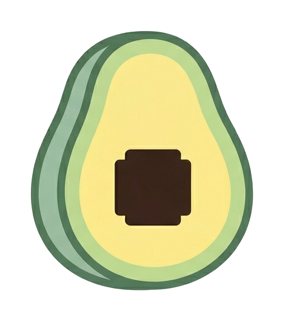
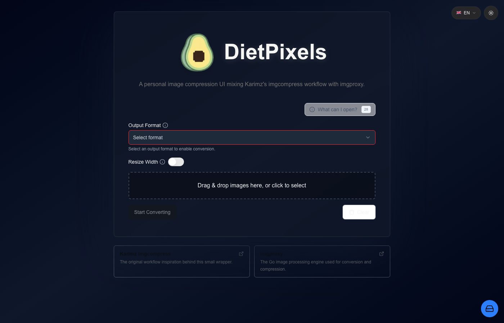

<h1 align="center">
  &nbsp;&nbsp;DietPixels
</h1>

<p align="center">
  Small self-hosted image compression UI backed by the official Go-based
  <a href="https://github.com/imgproxy/imgproxy"><code>darthsim/imgproxy</code></a> Docker image.
</p>

<p align="center">
  
</p>

This repository contains only the Next.js frontend and API wrapper. Image
processing is delegated to `imgproxy`, which runs as a sidecar service in Docker
Compose.

## Attribution

DietPixels is a personal-purpose remix of two excellent projects:

- Karim Zouine's [`imgcompress`](https://github.com/karimz1/imgcompress), which
  inspired the user-facing compression workflow and parts of the frontend
  experience.
- The [`imgproxy`](https://github.com/imgproxy/imgproxy) project, used here as
  the actual Go-based image processing backend through
  `darthsim/imgproxy:latest`.

This project is not an official release of either project. It combines ideas and
runtime pieces from both for a smaller wrapper focused on this specific Docker
Compose setup.

## Services

| Service | Source | Role |
| --- | --- | --- |
| `frontend` | built from `./frontend` | Next.js UI and API wrapper |
| `imgproxy` | `darthsim/imgproxy:latest` | image resize/format/quality processing |

## Run with Docker Compose

```bash
docker compose up --build -d
```

Open:

```text
http://localhost:3000
```

The frontend image is built as:

```text
dietpixels-frontend:latest
```

## Local frontend development

```bash
cd frontend
pnpm install
pnpm dev
```

For real conversions, keep the Compose stack running so the frontend can reach
the `imgproxy` service and shared upload/output volumes.

## Notes

- This wrapper repository does not include its own image-processing backend.
- Target-size compression is handled by the wrapper choosing quality values and
  asking `imgproxy` to render each candidate.
- Uploaded and converted files live in Docker volumes named `uploads` and
  `outputs`.

## Security & CI/CD

[](https://github.com/nagyonmarci/diet-pixels/actions/workflows/ci.yml)
[](https://github.com/nagyonmarci/diet-pixels/actions/workflows/publish.yml)
[](https://securityscorecards.dev/viewer/?uri=github.com/nagyonmarci/diet-pixels)
[](LICENSE)

The project ships a multi-layered DevSecOps pipeline covering the full
software supply chain from source code to signed container image.

### Pipeline gates

| Gate | Tool | Trigger | What it checks |
| --- | --- | --- | --- |
| Secrets Scan | gitleaks | push / PR | hardcoded credentials and tokens |
| Dockerfile Lint | hadolint | push / PR | Dockerfile best practices |
| Type Check | TypeScript (`tsc`) | push / PR | static type errors |
| Dependency Audit | `pnpm audit` | push / PR | HIGH / CRITICAL npm CVEs |
| SAST | GitHub CodeQL | push / PR | JS / TS vulnerability patterns |
| SAST | Semgrep | push / PR | Next.js, React, TypeScript security rules |
| License Compliance | `pnpm licenses list` | push / PR | GPL-3.0-compatible licenses only |
| Bundle Size | size-limit | push / PR | JS bundle ≤ 500 kB (brotli, all chunks) |
| Container Scan | Trivy | push / PR | OS and library CVEs in the Docker image |
| OpenSSF Scorecard | scorecard-action | push / weekly | supply chain security posture score |
| Image Signing | Cosign (keyless OIDC) | release | Sigstore attestation, no long-lived key |
| SBOM + Provenance | docker/build-push-action | release | supply chain transparency artifacts |
| Automated Updates | Dependabot | weekly (Monday) | npm, Docker, GitHub Actions dependencies |

### Security principles

- **Least privilege** — each CI job declares only the permissions it needs via
  per-job `permissions` blocks; the top-level default is `{}`
- **SHA-pinned actions** — every `uses:` line is locked to a full commit SHA,
  never a mutable tag
- **SARIF in Security tab** — CodeQL, Semgrep, and Trivy results are uploaded
  to the GitHub Security tab for unified vulnerability tracking
- **Keyless image signing** — released images are signed with Cosign using a
  short-lived OIDC token; no private key is stored anywhere
